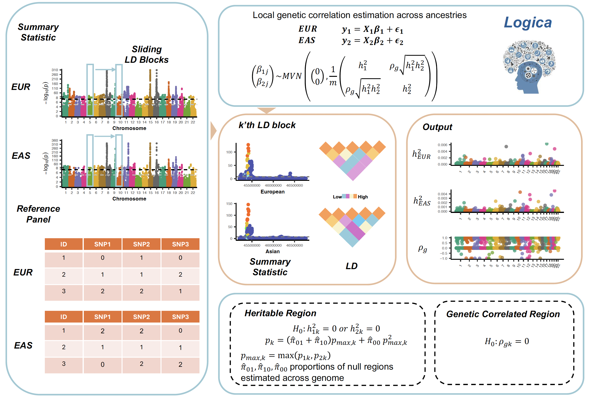

# Logica

## A likelihood framework for cross-ancestry local genetic correlation estimation using summary statistics (Logica)



Logica (LOcal GenetIc Correlation across Ancestries), a new method specifically designed to estimate local genetic correlations across ancestries. Logica employs a bivariate linear mixed model that explicitly accounts for diverse LD patterns across ancestries, operates on GWAS summary statistics, and utilizes a maximum likelihood framework for robust inference.
Logica is implemented as an open-source R package, freely available at [Zhou lab](https://www.xzlab.org/software.html).

## Installation

To install the latest version of the Logica package from GitHub, run
the following code in R:

```R
library(devtools)
install_github("borangao/Logica")
```

This command should automatically install all required packages if
they are not installed already.

## Quick Start

See [Tutorial](https://github.com/borangao/Logica_Analysis) for detailed documentation and examples.

## Issues
All feedback, bug reports and suggestions are warmly welcomed! Please contact me at gao824@purdue.edu. Please make sure to raise issues with a detailed and reproducible exmple and also please provide the output of your sessionInfo() in R! 

How to cite `Logica`
-------------------
Boran Gao, Zheng Li, Xiang Zhou. Logica: A likelihood framework for cross-ancestry local genetic correlation estimation using summary statistics

